# Taskify

A Flutter application designed to provide a user-friendly interface for adding tasks notes and saving it offline.

---

## Features

- **CRUD**  
  Users can Create, Read, Update and Delete.

- **Fully Offline**  
  Users can use the app offline, without the need to connect to the internet.

- **Add Notes**  
  Allows users to add notes with title and descriptions.

- **Add Tasks**  
  Allows users to add task title descriptions.

- **Data History**  
  Allows users to save all tasks and notes.

- **User Friendly**  
  Allows users to use the app with ease.

---

## Screenshots

<div style="display: flex; justify-content: center; gap: 20px;">
   
   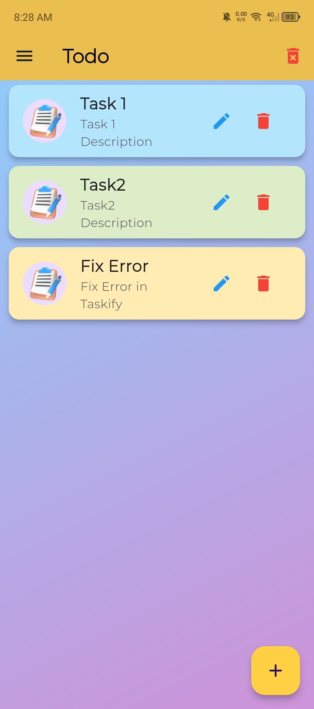
   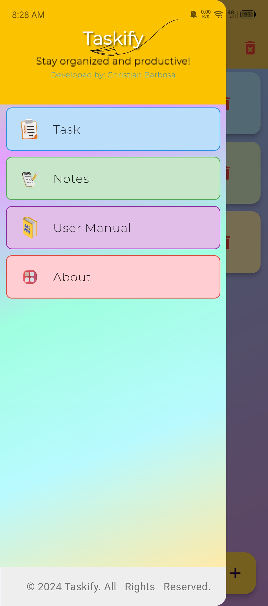
   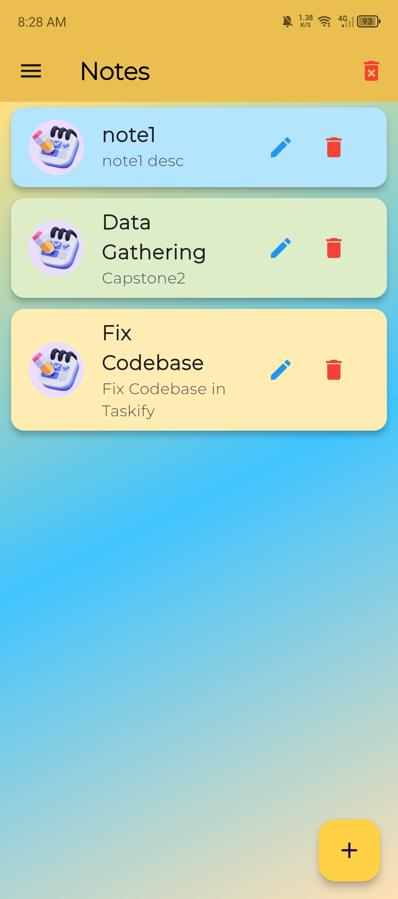
   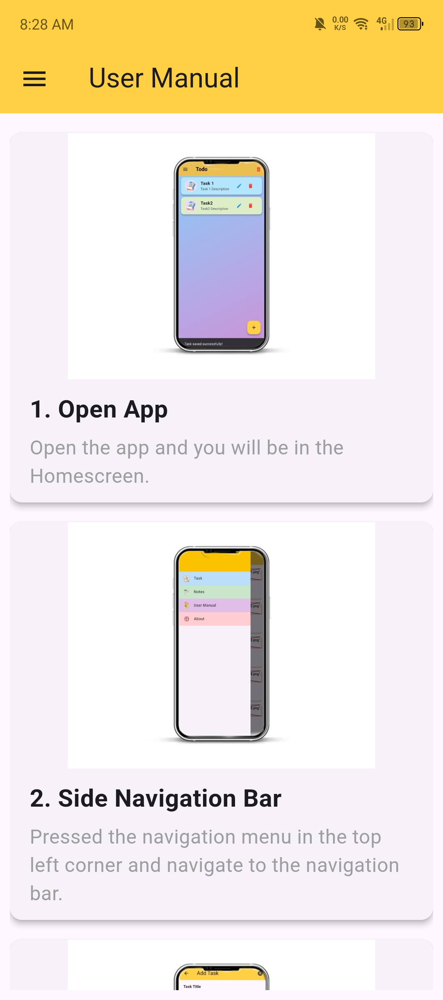
   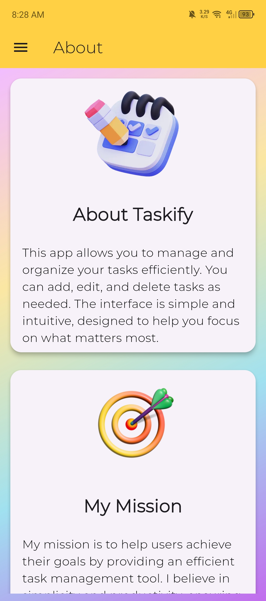
   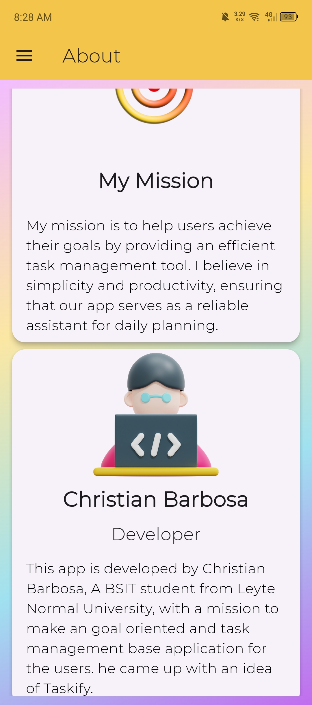
   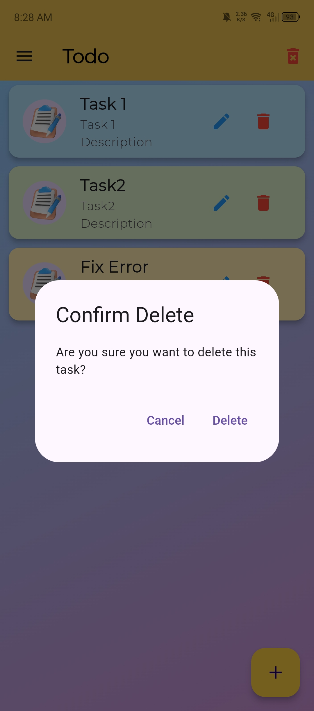
   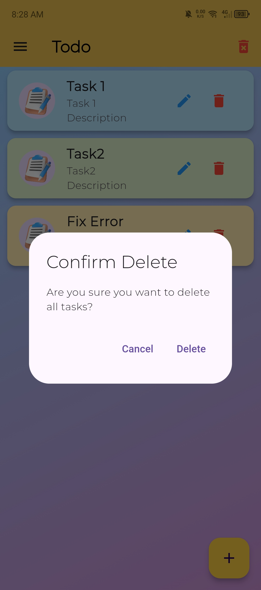
   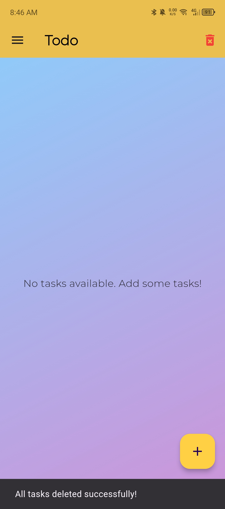
   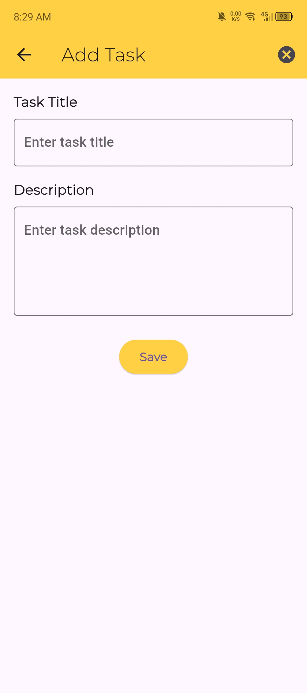
   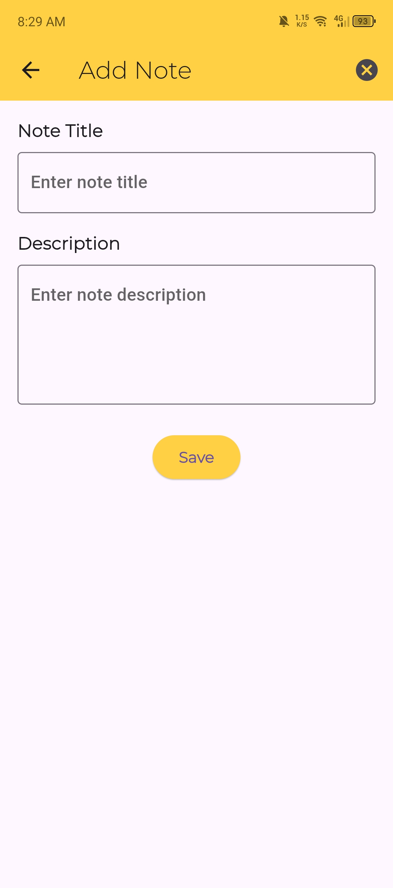
</div>

---

## Requirements

- [Flutter SDK: Version 3.22.3 or later](https://flutter.dev/docs/get-started/install)
- [Dart : Version 2.17.0 or later](https://dart.dev/get-dart)
- [Android Studio](https://developer.android.com/studio)
- [Visual Studio Code](https://code.visualstudio.com/)
- [Supported Platforms: Android, iOS, Linux, Windows, Macos and Web.](https://flutter.dev/multi-platform)

## Required Dependencies/Packages
- [sqflite 2.4.1 ](https://pub.dev/packages/sqflite)
- [flutter_launcher_icons 0.14.1 or later](https://pub.dev/packages/sqflite)
- [local_auth 2.3.0](https://pub.dev/packages/local_auth)

---

## How to Set up this Project?

### Step 1: Install Flutter

1. **Download Flutter SDK**  
   Visit the [Flutter Website](https://flutter.dev/docs/get-started/install) and follow the installation instructions for your operating system.

2. **Verify Installation**  
   Run the following command in your terminal to ensure Flutter is correctly installed:
   ```bash
   flutter doctor

### Step 2: Install Android Studio
1. Download [Android Studio Here](https://developer.android.com/studio) and follow the installation instructions for your operating system.

2. **Verify Installation** 

3. **Setup android studio**  

4. **Download Emulator** 

5. **Integrate Virtual Emulator path to your VS code / If you don't want virtual emulator, use physical device** 

- In your Physical Device Open Android build Version Click it 7 times.
- You are now a Developer.
- Navigate to Developer Options.
- Navigate and Allow USB Debugging.
- Connect your physical device to your computer using cable.

## Clone Repository / Project Repository
1. Be sure you have already install git.

2. Download [Git Here](https://git-scm.com/downloads) and follow the installation instructions for your operating system.

3. Install and setup git in your computer.

4. Open command prompt in your computer and type this command and press enter to clone my project repository.
   ```bash
   git clone 'https://github.com/lightdarkmaster/Todotask'

## Installation of the Project Instructions

1. Go to Project Directory
   ```bash
   cd todoapp
2. Install packages and dependencies
   ```bash
   flutter pub get
3. Run the project
   ```bash
   flutter run

## Building the app

1. Build apk for all platform single command:
    ```bash
    flutter build apk --target-platform android-arm,android-arm64,android-x64 --split-per-abi

--- end ---